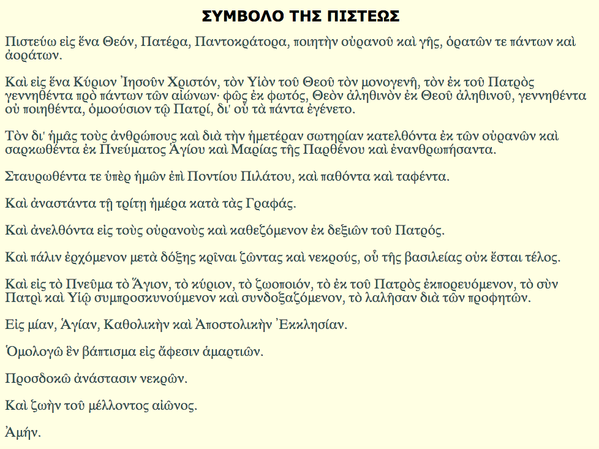

Η εφαρμογή αυτή περιέχει το Σύμβολο της Πίστεως.

Το Σύμβολο της Πίστεως θεσπίστηκε κατά την Α΄ και Β΄ Οικουμενική Σύνοδο από την Εκκλησία και έγινε δεκτό από όλες τις χριστιανικές ομολογίες

<b>Google Play:</b> https://play.google.com/store/apps/details?id=appinventor.ai_fsiamp.SIMVOLOTISPISTEOS

